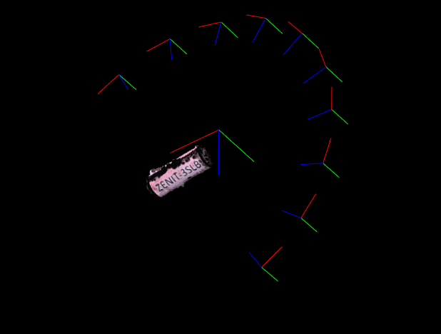
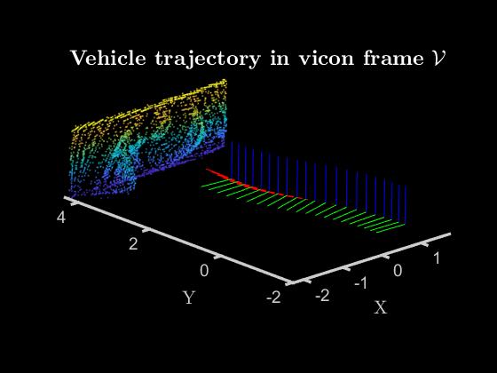
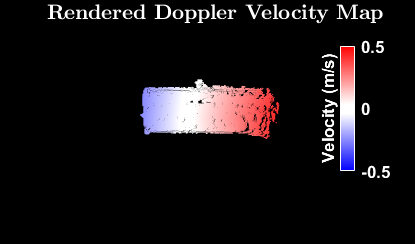
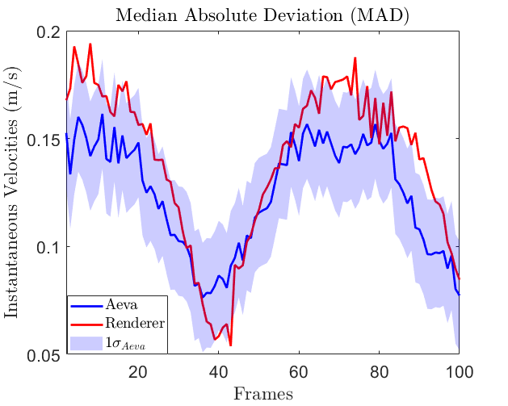

# Development and Validation of Velocimeter LIDAR Simulator
### Calibrating point clouds and velocimetry from a FMCW Lidar sensor against synthetic data generated from our rendering software. <br />
#### Ramchander Bhaskara, Roshan Eapen, Manoranjan Majji
--- 
_Status_ (Jan'25): Lidar simulation validated with hardware. Statistically agreements/disagreements between rendered and real-data are reported. Poster 

Paper: https://arc.aiaa.org/doi/10.2514/6.2025-2600 (AIAA SciTech 2025)

Poster: https://ram-bhaskara.github.io/assets/imgs/pubs/LidarValidation_GNC2024.pdf (AAS GNC 2024, Breckenridge, CO.)
<br />

_Coming up_: File cleanup. Please reach out if require help with setting up the software.

_Process_: We collect FMCW datasets from real-world scenes using Aeva 4D Lidar (example). We also collect the ground truth trajectory information (poses, velocities) using vicon system. 3D assets are generated from dense reconstruction of the real-world scene. We simulate the physics of the FMCW Lidar using a custom ray-tracing software built at [LASR laboratory](https://lasr.tamu.edu/). Ultimately, we compare the statistically similarities between the rendered and the sensor outputs. 

_Note_: We used two datasets (shown below) to validate our results: asteroid wall (landing approach) and spinning satellite (proximity ops). Datasets and rendering softwares are not public. Reach out to [me](bhaskara@tamu.edu) for details. 


## Results

<div align="center">
  <div style="display: inline-block; margin: 10px;">
     <br/>
  <em>Camera poses around reconstructed point cloud object in world frame</em>
  </div>

  <div style="display: inline-block; margin: 10px;">
     <br/>
  <em>Reconstructed point cloud and ground truth trajectory from vicon</em> 
  </div>
</div>

<div align="center">
  <div style="display: inline-block; margin: 10px;">
     <br/>
  <em>Reconstructed point cloud and point velocities</em>
  </div>

  <div style="display: inline-block; margin: 10px;">
     <br/>
  <em>Median Absolute Deviations (MAD) of point velocities from NaRPA (red) and Aeva lidar (blue), within 1-sigma of velocities from sensor</em>
  </div>
</div>


## BibTeX Citation

If you use our software/approach/analysis in a scientific publication, we would appreciate using the following citations:

```
@inproceedings{bhaskara2025development,
  title={Development and Validation of Velocimeter LIDAR Simulator},
  author={Bhaskara, Ramchander and Eapen, Roshan T and Majji, Manoranjan},
  booktitle={AIAA SCITECH 2025 Forum},
  pages={2600},
  year={2025}
}

@article{eapen2022narpa,
  title={NaRPA: Navigation and Rendering Pipeline for Astronautics},
  author={Eapen, Roshan Thomas and Bhaskara, Ramchander Rao and Majji, Manoranjan},
  journal={arXiv preprint arXiv:2211.01566},
  year={2022}
}
```

## License

This project is licensed under the [Attribution-NonCommercial-NoDerivs 3.0 Unported (CC BY-NC-ND 3.0)](LICENSE) License.
